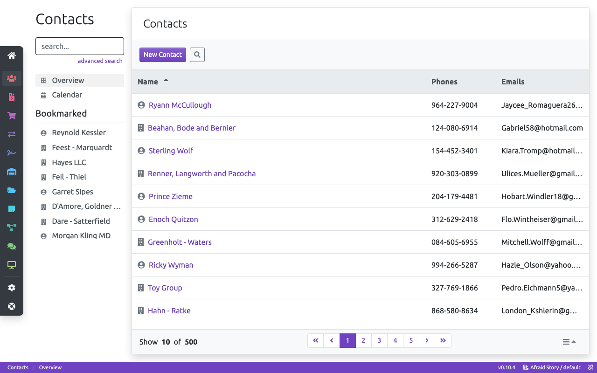

# Balnc

**WARNING: This application is a currently MOCK-UP and is under heavy development. It SHOULD NOT be used for any other propose than showcase of the underline technologies and the implementation approach.**

Balnc (balance) is a software framework for develop business applications. It is a base system that on top are implemented collections of business modules which eventually create a tailor made application for small an medium size businesses.

With Balnc software developers may quickly bootstrap applications and use premade modules from Balnc Packages or create their own. This collection includes sales, marketing and accounting modules and it is both open source and free under the MIT license.

## Main Features

- Builded with [Angular](https://angular.io/) and [rxdb](https://github.com/pubkey/rxdb)
- [PWA](https://developers.google.com/web/progressive-web-apps/) and offline-first
- Low cost and scalable db servers (couchdb, etc)
- Every module can be extended and custom modules can be implemented (menus are extendable)

## License

The MIT License (MIT)

Copyright (c) 2018 Christos Georgiou

Permission is hereby granted, free of charge, to any person obtaining a copy
of this software and associated documentation files (the "Software"), to deal
in the Software without restriction, including without limitation the rights
to use, copy, modify, merge, publish, distribute, sublicense, and/or sell
copies of the Software, and to permit persons to whom the Software is
furnished to do so, subject to the following conditions:

The above copyright notice and this permission notice shall be included in all
copies or substantial portions of the Software.

THE SOFTWARE IS PROVIDED "AS IS", WITHOUT WARRANTY OF ANY KIND, EXPRESS OR
IMPLIED, INCLUDING BUT NOT LIMITED TO THE WARRANTIES OF MERCHANTABILITY,
FITNESS FOR A PARTICULAR PURPOSE AND NONINFRINGEMENT. IN NO EVENT SHALL THE
AUTHORS OR COPYRIGHT HOLDERS BE LIABLE FOR ANY CLAIM, DAMAGES OR OTHER
LIABILITY, WHETHER IN AN ACTION OF CONTRACT, TORT OR OTHERWISE, ARISING FROM,
OUT OF OR IN CONNECTION WITH THE SOFTWARE OR THE USE OR OTHER DEALINGS IN THE
SOFTWARE.
