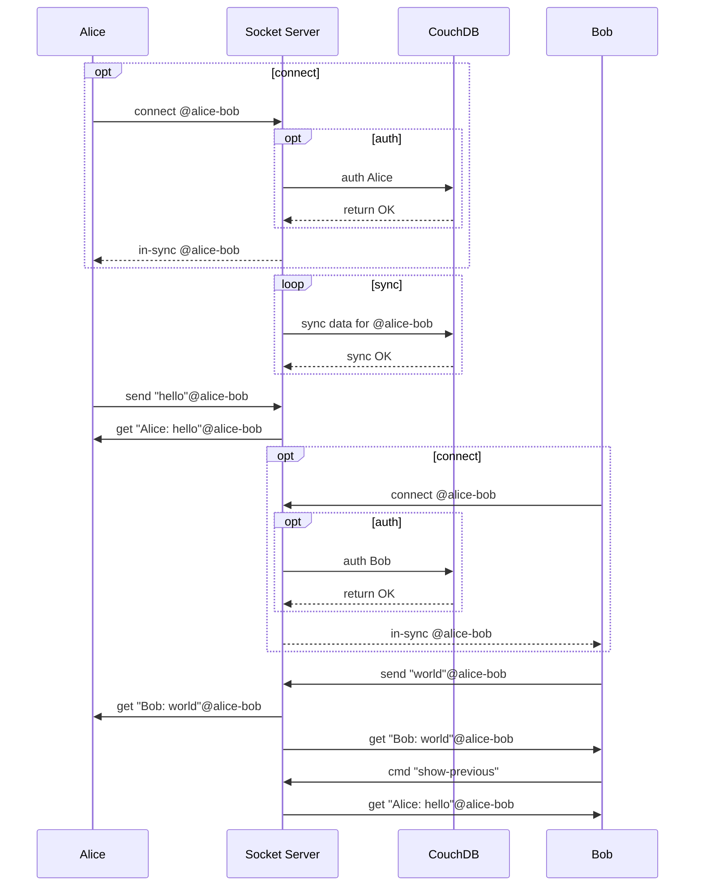

#Diagrams

## Chat messages

```mermaid
sequenceDiagram
    opt connect
        Alice ->> Socket Server: connect @alice-bob
        opt auth
            Socket Server ->> CouchDB: auth Alice
            CouchDB -->> Socket Server: return OK
        end
        Socket Server -->> Alice: in-sync @alice-bob
    end
    loop sync
        Socket Server ->> CouchDB: sync data for @alice-bob
        CouchDB -->> Socket Server: sync OK
    end
    Alice ->> Socket Server: send "hello"@alice-bob
    Socket Server ->> Alice: get "Alice: hello"@alice-bob
    opt connect
        Bob ->> Socket Server: connect @alice-bob
        opt auth
            Socket Server ->> CouchDB: auth Bob
            CouchDB -->> Socket Server: return OK
        end
        Socket Server -->> Bob: in-sync @alice-bob
    end
    Bob ->> Socket Server: send "world"@alice-bob
    Socket Server ->> Alice: get "Bob: world"@alice-bob
    Socket Server ->> Bob: get "Bob: world"@alice-bob
    Bob ->> Socket Server: cmd "show-previous"
    Socket Server ->> Bob: get "Alice: hello"@alice-bob
```