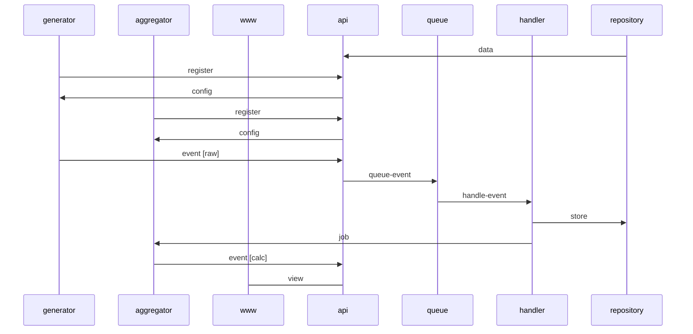

# Monitor - `@balnc/monitor`

All monitors will store event-logs in db. Monitor package can display these log in a nice way with tables, charts etc

- server-monitor
  - uptime
  - latency
- errors
  - exceptions
- metrics
  - counters

## Generators

Generators are small packages that inserts logs in the db. It may be a stand alone nodejs app or an npm module that is included in another.

### Sample generators

- telemetry - this balnc-module will send client event-logs for further development and improvement of the application.
- server monitor - sends a http-head or ping in interval and store metrics
- logger - send errors and metrics of the external app that is installed

## Aggregators

Every event-log may be parsed from one or more aggregator. These aggregators run from blnc-server and produce new event-logs that can be viewed. Multiple levels of aggregations may be performed. Te configurations of these aggregation function can be made from blnc.

## Schema

